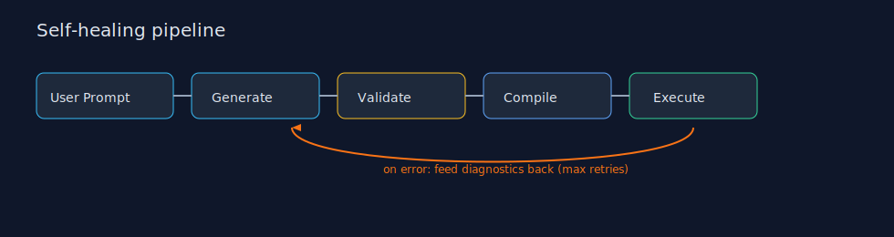
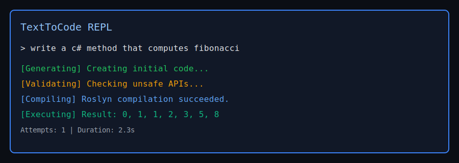
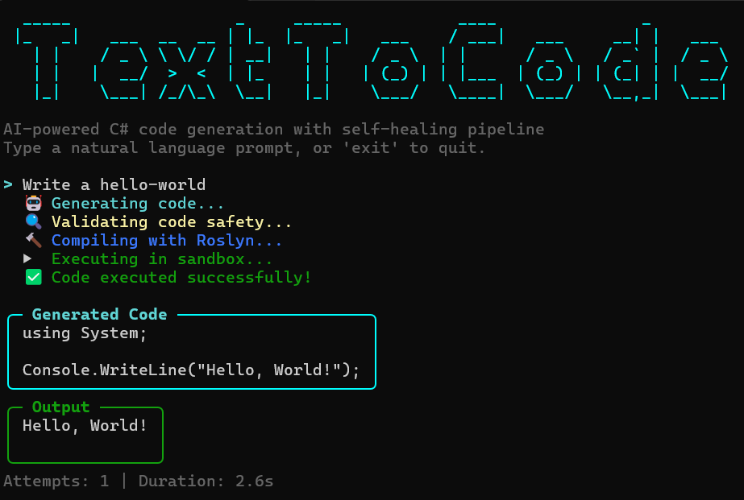
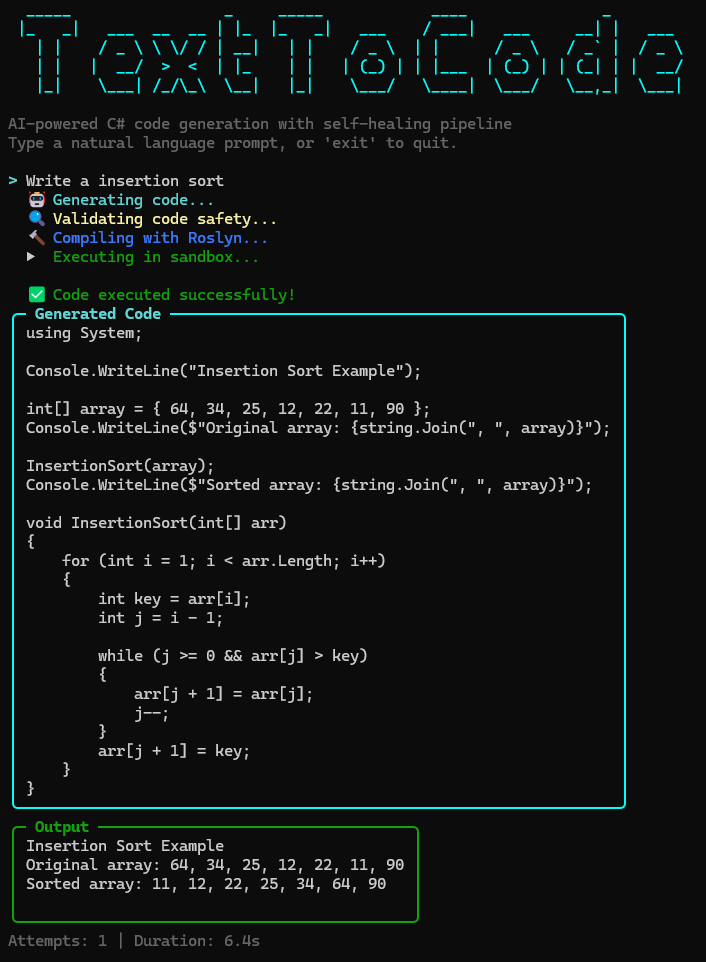

# TextToCode

AI-powered C# code generation engine with a self-healing pipeline that validates, compiles, and safely executes generated code.

## Features

- Self-healing pipeline: generate -> validate -> compile -> execute, with diagnostics fed back for retries.
- Roslyn compilation + AST safety validation for dangerous APIs.
- Sandboxed execution with timeout controls.
- Console REPL and REST API + SignalR streaming.
- Clean architecture with Core, Application, Infrastructure, and Presentation layers.

## Architecture

Pipeline flow:



Key patterns:
- Strategy: swappable `ILlmClient`, `ICodeCompiler`
- Visitor: `DangerousApiWalker`
- Pipeline: self-healing loop
- Observer: `IProgress<T>` / `Progress<T>` (see below)
- Options pattern
- Collectible `AssemblyLoadContext` for sandboxed execution

### Observer Pattern — `IProgress<T>` / `Progress<T>`

The pipeline reports real-time progress through .NET's built-in `IProgress<PipelineProgressUpdate>` interface. This decouples the pipeline from any specific UI or transport — the pipeline never knows *who* is listening, only that it can report status.

Each presentation layer provides its own `Progress<T>` callback:

```
CodeGenerationPipeline.ExecuteAsync(prompt, ..., IProgress<T> progress)
        │
        ├── Console REPL
        │     new Progress<T>(update => ConsoleRenderer.RenderProgressUpdate(update))
        │     → Spectre.Console markup output to terminal
        │
        ├── SignalR Hub
        │     new Progress<T>(async update => await Clients.Caller.SendAsync("ProgressUpdate", update))
        │     → real-time push to connected browser/client
        │
        └── (extensible) — add any new consumer without modifying the pipeline
              e.g. logging, file output, webhooks, message queues...
```

This means adding a new output channel (e.g. a Blazor UI, a gRPC stream, or a log sink) requires zero changes to the Application or Infrastructure layers — just wire up a new `Progress<T>` callback at the presentation boundary.

## Solution Structure

Projects in `TextToCode.slnx`:

- Core: `TextToCode.Core` (interfaces, entities, value objects, enums, exceptions)
- Application: `TextToCode.Application` (pipeline, services, DTOs)
- Infrastructure: `TextToCode.Infrastructure` (Roslyn compiler, safety validator, sandbox, OpenRouter client)
- Presentation: `TextToCode.Console` (CLI + REPL)
- Presentation: `TextToCode.WebApi` (REST API + SignalR + Swagger)
- Tooling: `TextToCode.SignalRClient` (CLI test client for SignalR hub)
- Tests: `TextToCode.Core.Tests`, `TextToCode.Application.Tests`, `TextToCode.Infrastructure.Tests`

## Prerequisites

- .NET SDK `10.0.102` (see `global.json`)
- OpenRouter API key

## Configuration

Both Console and Web API read settings from `appsettings.json`.

OpenRouter options:
- `OpenRouter:ApiKey`
- `OpenRouter:BaseUrl` (default: `https://openrouter.ai/api/v1`)
- `OpenRouter:Model` (default: `anthropic/claude-sonnet-4`)
- `OpenRouter:Temperature`
- `OpenRouter:MaxTokens`

Pipeline options:
- `Pipeline:MaxRetries`
- `Pipeline:ExecutionTimeoutSeconds`

Environment variables:
- Console uses prefix `TEXTTOCODE_`, e.g. `TEXTTOCODE_OpenRouter__ApiKey=...`
- Web API uses standard ASP.NET Core config keys, e.g. `OpenRouter__ApiKey=...`

## Usage

### Console CLI

Generate code once:

```
dotnet run --project src/TextToCode.Console generate "Write a C# method that computes Fibonacci"
```

Interactive REPL (default when no command specified):

```
dotnet run --project src/TextToCode.Console
```

REPL commands:
- `exit` or `quit` to leave
- `clear` to clear the screen

### Web API

Run the API:

```
dotnet run --project src/TextToCode.WebApi
```

Endpoints:
- `GET /api/health`
- `POST /api/codegen/generate`
- SignalR hub: `/hubs/codegen`

Example request:

```
curl -X POST http://localhost:5000/api/codegen/generate \
  -H "Content-Type: application/json" \
  -d "{\"prompt\":\"Write a C# method that computes Fibonacci\"}"
```

SignalR events:
- `ProgressUpdate` (streamed status)
- `GenerationComplete` (final response)

## Screenshots



**Example1: Hello World**


**Example2: Selection Sort**


## Tests

```
dotnet test TextToCode.slnx --verbosity normal
```

## Notes

- Default max retries: 3 (total attempts = `MaxRetries + 1`)
- Execution timeout defaults to 10 seconds
